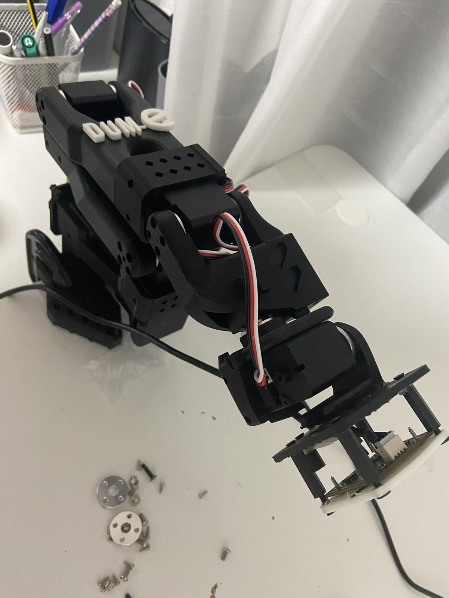

# Dum-E 🦾🎬

An autonomous robotic videographer for hardware projects — a Claude Code Skill that
drives an SO-101 arm-mounted camera to plot, shoot, and stitch short demo videos
from a single line of intent.

> Named after Tony Stark's clumsy, endearing lab-assistant arm. Minor imperfection
> is on-brand — this is a prototype.

## Layout

| Path | Role |
|------|------|
| `src/dum_e/` | Control **library** (importable, tested). `arm.py` is the sole servo path. |
| `scripts/` | Thin CLI **adapters** — each prints one JSON object on stdout (see contract). |
| `.claude/skills/dum-e/` | The Claude **director** (`SKILL.md`) that orchestrates the scripts. |
| `schemas/` | Frozen JSON schemas (e.g. the shot-log contract, Story 3.5). |
| `runs/` | Runtime artifacts (gitignored). |
| `calibration/` | Calibration **profiles** tracked (`joints.json`, `handeye.json`); transient captures gitignored. |
| `train/` | v2 placeholder — consumes `runs/` as a `LeRobotDataset`. |

Planning docs live under `documents/planning-artifacts/` (PRD, architecture, epics)
and `documents/implementation-artifacts/` (stories, sprint status).

## Script I/O contract (frozen)

Every `scripts/*` command prints **exactly one JSON object** to stdout:

```json
{ "ok": true, "data": {}, "error": null, "artifacts": [] }
```

Exit code is `0` iff `ok` is `true`. All human/diagnostic logging goes to **stderr**
so stdout stays pure JSON (Claude parses it). Use `dum_e.cli` — never hand-roll it.

## Setup

v1 is **CPU-only** — no GPU/ROCm needed (that's reserved for v2 training).

```bash
# conda/mamba (recommended — LeRobot/ROCm wheels are conda-friendly)
conda create -n dum-e python=3.12 -y
conda activate dum-e
pip install -e ".[dev]"          # add ".[dev,yolo]" once you reach Story 2.6

# or plain venv
python -m venv .venv && source .venv/bin/activate
pip install -e ".[dev]"
```

> Pin the exact `lerobot` version after confirming current SO-101 support on the
> Hugging Face docs ("Assemble SO-101").

## Test

```bash
pytest
```

## Build log

Progress a weekend at a time — newest on top.

| Weekend | Highlights | Photo |
|--------|-----------|-------|
| **1** | Assembled the SO-101; camera + motor **bring-up**; arm-safety chokepoint (`arm.py`, the sole servo path); **re-based the motor driver on LeRobot**; hand-eye calibration scaffolding; **all 6 joints range-calibrated** (re-zeroed, real soft limits in `config.yaml`). 5/6 joints move under command — elbow (motor 3) pending a beefier power supply. | <a href="docs/dum-e.jpg"></a> |
